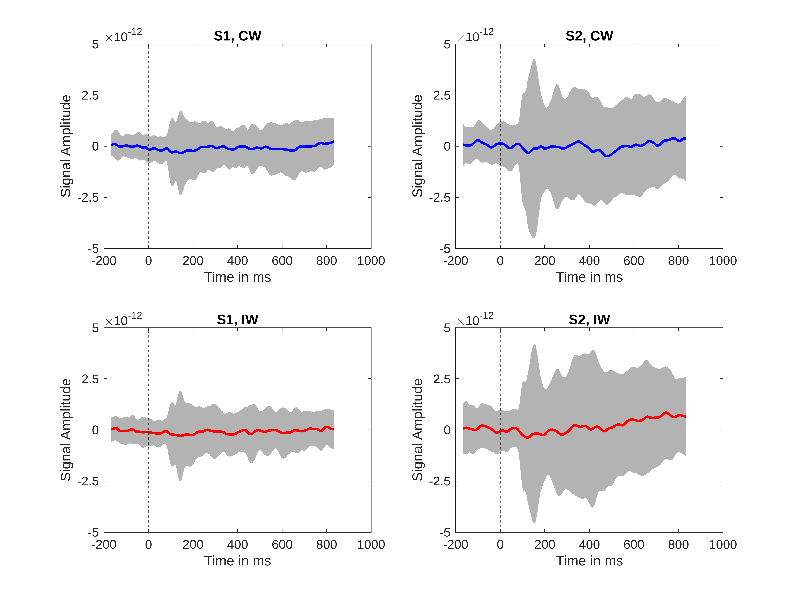

# Analysis of Evoked Fields
```matlab
load CIBA120_data.mat
load grad_loc.mat

% gradiometer IDs
inputNames
```

```matlabTextOutput
inputNames = 1x204 cell
'0112'      '0113'      '0122'      '0123'      '0132'      '0133'      '0142'      '0143'      '0212'      '0213'      '0222'      '0223'      '0232'      '0233'      '0242'      '0243'      '0312'      '0313'      '0322'      '0323'      '0332'      '0333'      '0342'      '0343'      '0412'      '0413'      '0422'      '0423'      '0432'      '0433'      

```

```matlab

% time from word onset (ms)
time_points
```

```matlabTextOutput
time_points = 1x1001
  -167  -166  -165  -164  -163  -162  -161  -160  -159  -158  -157  -156  -155  -154  -153  -152  -151  -150  -149  -148  -147  -146  -145  -144  -143  -142  -141  -140  -139  -138  -137  -136  -135  -134  -133  -132  -131  -130  -129  -128  -127  -126  -125  -124  -123  -122  -121  -120  -119  -118

```

```matlab

% congruent condition (epochs x channels x timepoints)
size(ep_cong_s1)
```

```matlabTextOutput
ans = 1x3
         108         204        1001

```

```matlab

% size(ep_incong_s1)
% size(ep_cong_s2)
% size(ep_incong_s2)
```

```matlab
global_cong_s1 = squeeze(mean(ep_cong_s1));
global_incong_s1 = squeeze(mean(ep_incong_s1));

mean_cong_s1 = squeeze(mean(global_cong_s1));
mean_incong_s1 = squeeze(mean(global_incong_s1));

std_cong_s1 = squeeze(std(global_cong_s1));
std_incong_s1 = squeeze(std(global_incong_s1));

global_cong_s2 = squeeze(mean(ep_cong_s2));
global_incong_s2 = squeeze(mean(ep_incong_s2));

mean_cong_s2 = squeeze(mean(global_cong_s2));
mean_incong_s2 = squeeze(mean(global_incong_s2));

std_cong_s2 = squeeze(std(global_cong_s2));
std_incong_s2 = squeeze(std(global_incong_s2));
```

```matlab
function p = plotResponse(x, y, yerr, col, text)

    gray = [.7 .7 .7];
    y_ticks = [-5 * 10^-12, -2.5 * 10^-12, 0, 2.5 * 10^-12, 5 * 10^-12];
    y_lims = y_ticks([1, end]);

    errorbar(x, y, yerr, "Color", gray, "LineWidth", 0.1, "MarkerSize", 0.1, "CapSize", 0)
    hold on
    
    plot(x, y, col)
    xline(0, "--k")
    
    ylim(y_lims)
    yticks(y_ticks)
    
    xlabel("Time in ms")
    ylabel("Signal Amplitude")
    
    title(text)
    hold off

end
```

```matlab
figure;

subplot(2, 2, 1)
plotResponse(time_points, mean_cong_s1, std_cong_s1, "b", "S1, CW")

subplot(2, 2, 2)
plotResponse(time_points, mean_cong_s2, std_cong_s2, "b", "S2, CW")

subplot(2, 2, 3)
plotResponse(time_points, mean_incong_s1, std_incong_s1, "r", "S1, IW")

subplot(2, 2, 4)
plotResponse(time_points, mean_incong_s2, std_incong_s2, "r", "S2, IW")
```


