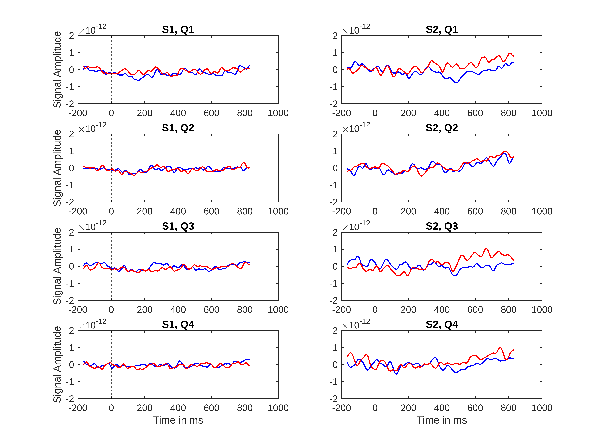

```matlab
load CIBA120_data.mat
load grad_loc.mat

% gradiometer IDs
inputNames
```

```matlabTextOutput
inputNames = 1x204 cell
'0112'      '0113'      '0122'      '0123'      '0132'      '0133'      '0142'      '0143'      '0212'      '0213'      '0222'      '0223'      '0232'      '0233'      '0242'      '0243'      '0312'      '0313'      '0322'      '0323'      '0332'      '0333'      '0342'      '0343'      '0412'      '0413'      '0422'      '0423'      '0432'      '0433'      

```

```matlab

% time from word onset (ms)
time_points
```

```matlabTextOutput
time_points = 1x1001
  -167  -166  -165  -164  -163  -162  -161  -160  -159  -158  -157  -156  -155  -154  -153  -152  -151  -150  -149  -148  -147  -146  -145  -144  -143  -142  -141  -140  -139  -138  -137  -136  -135  -134  -133  -132  -131  -130  -129  -128  -127  -126  -125  -124  -123  -122  -121  -120  -119  -118

```

```matlab

% congruent condition (epochs x channels x timepoints)
size(ep_cong_s1)
```

```matlabTextOutput
ans = 1x3
         108         204        1001

```

```matlab

% size(ep_incong_s1)
% size(ep_cong_s2)
% size(ep_incong_s2)
```

```matlab
N = 4;
col_list = repmat(linspace(0.75, 0, 4)', 1, 3);

function y = splitSeries(x, N)

    y = {};
    sub_size = size(x, 1) / N;
    
    for i = 1:N
    
        x_sub = x((i - 1) * sub_size + 1:i * sub_size, :, :);
        y{i} = squeeze(mean(mean(x_sub)));
    
    end

end

sub_cong_s1 = splitSeries(ep_cong_s1, N);
sub_incong_s1 = splitSeries(ep_incong_s1, N);
sub_cong_s2 = splitSeries(ep_cong_s2, N);
sub_incong_s2 = splitSeries(ep_incong_s2, N);

```

```matlab
y_ticks = [-2 * 10^-12, -1 * 10^-12, 0, 1 * 10^-12, 2 * 10^-12];
y_lims = y_ticks([1, end]);

figure;

for i = 1:N

    subplot(N, 2, 2 * i - 1)
    plot(time_points, sub_cong_s1{i}, "Color", "b", "LineWidth", 1.2)
    hold on

    plot(time_points, sub_incong_s1{i}, "Color", "r", "LineWidth", 1.2)
    xline(0, "--k")

    title("S1, Q" + string(i))
    ylabel("Signal Amplitude")

    ylim(y_lims)
    yticks(y_ticks)
    hold off

end

xlabel("Time in ms")

for i = 1:N

    subplot(N, 2, 2 * i)
    plot(time_points, sub_cong_s2{i}, "Color", "b", "LineWidth", 1.2)
    hold on

    plot(time_points, sub_incong_s2{i}, "Color", "r", "LineWidth", 1.2)
    xline(0, "--k")
    
    ylim(y_lims)
    yticks(y_ticks)

    title("S2, Q" + string(i))
    hold off

end

xlabel("Time in ms")
```


